# Simple Docker (willetts)

## Part 1. Готовый докер

После запуска докера начинаем выполнять задание:  
- Сначала скачиваем официальный докер-образ nginx с помощью команды docker pull nginx  
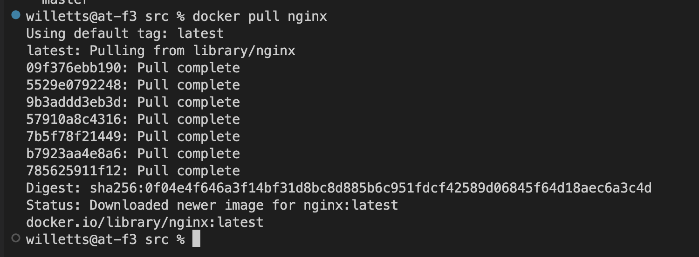   
- Затем проверяем наличие докер-образа через docker images  
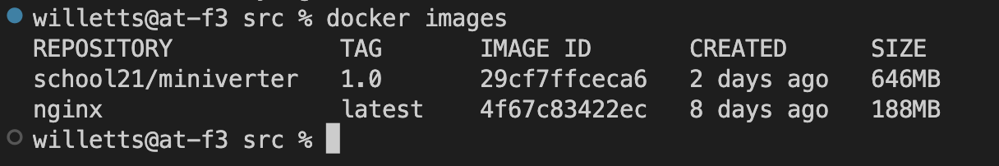   
- После этого запускаем докер-образ через docker run -d [image_id|repository]; в нашем случае docker run -d nginx
- Проверяем, что всё запустилось через docker ps  
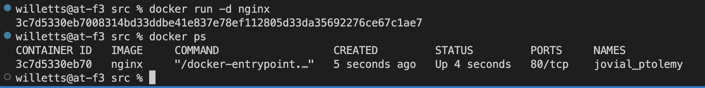   
- Посмотрим информацию о контейнере через docker inspect [container_id|container_name]
    - Чтобы посмотреть размер воспользуемся командой добавим к команде спецификатор size (и перенаправим вывод в файл)  
    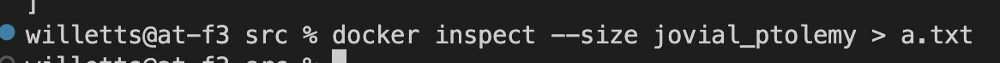   
    При наличии данного спецификатора в вывод команды добавятся строки “SizeRootFs” и “SizeRW”.  
    _SizeRootFs_ показывает общий вес всех файлов в контейнере, в байтах  
    _SizeRW_ – вес новых или изменённых по сравнению с оригинальным изображением (image) файлов, тоже в байтах  
       
    - Для нахождения замапленных портов и ip контейнера достаточно команды docker inspect    
    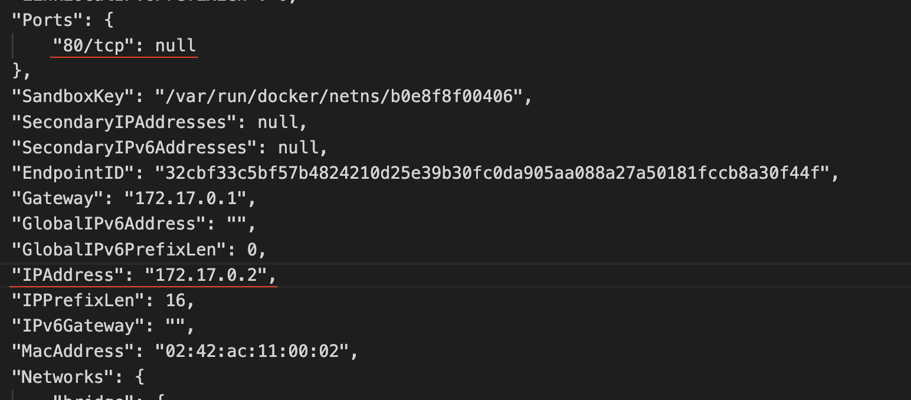   
    - Таким образом,  
    **Размер**: 187668955 байт (~187,6 Мб),  
    **Замапленный порт**: 80/tcp,  
    **Ip контейнера**: 172.17.0.2
- Остановим докер образ через docker stop [container_id|container_name]  
- Проверим, что он остановился  
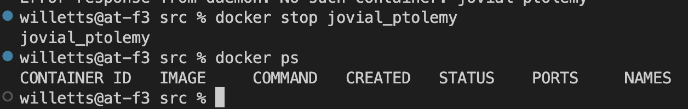   
- Запустим докер с портами 80 и 443 в контейнере, замапленными на такие же порты на локальной машине, через команду run.  
  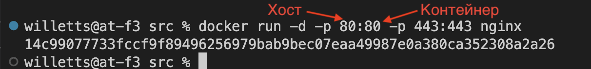   
  > Примечание: флаг -d позволяет контейнеру работать “на заднем фоне”, в противном случае его работа зависела бы от терминала
- Проверим, что в браузере по адресу localhost:80 доступна стартовая страница nginx  
  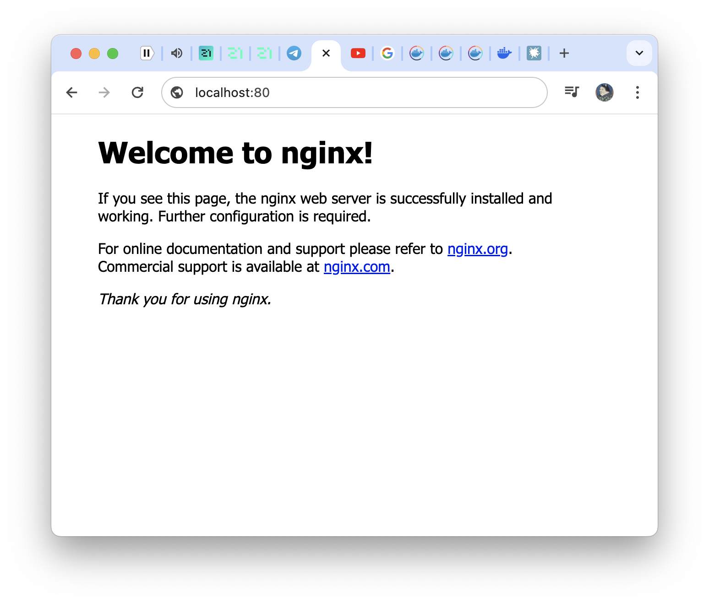   
- Перезапустим докер контейнер через docker restart [container_id|container_name]  
  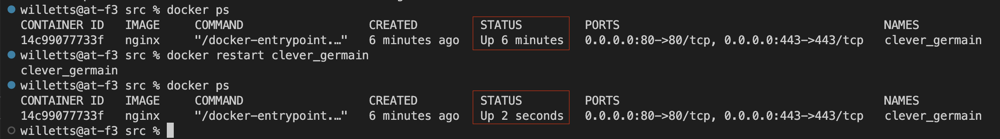   

## Part 2. Операции с контейнером

- Прочитаем конфигурационный файл nginx.conf внутри докер контейнера через команду exec.    
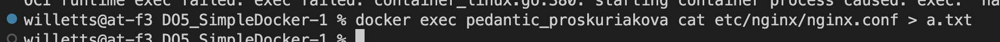   
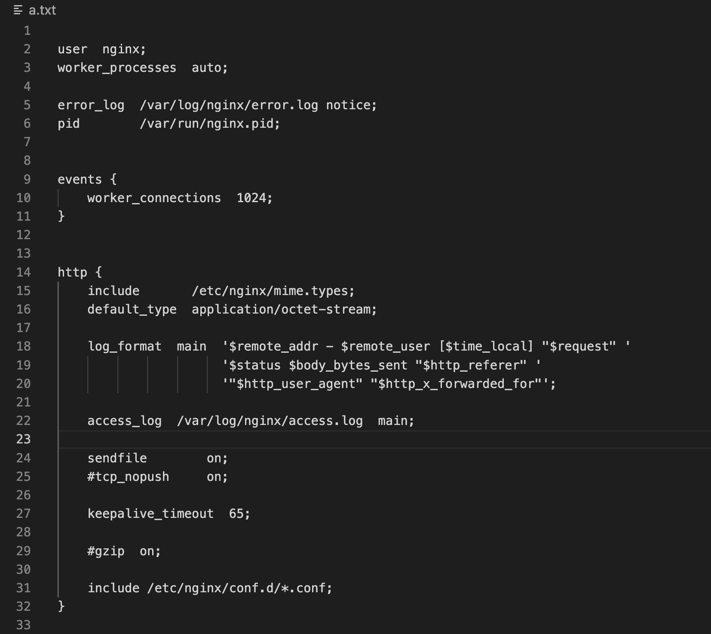   
- Создадим на локальной машине файл nginx.conf. По образу файла nginx.conf внутри контейнера  
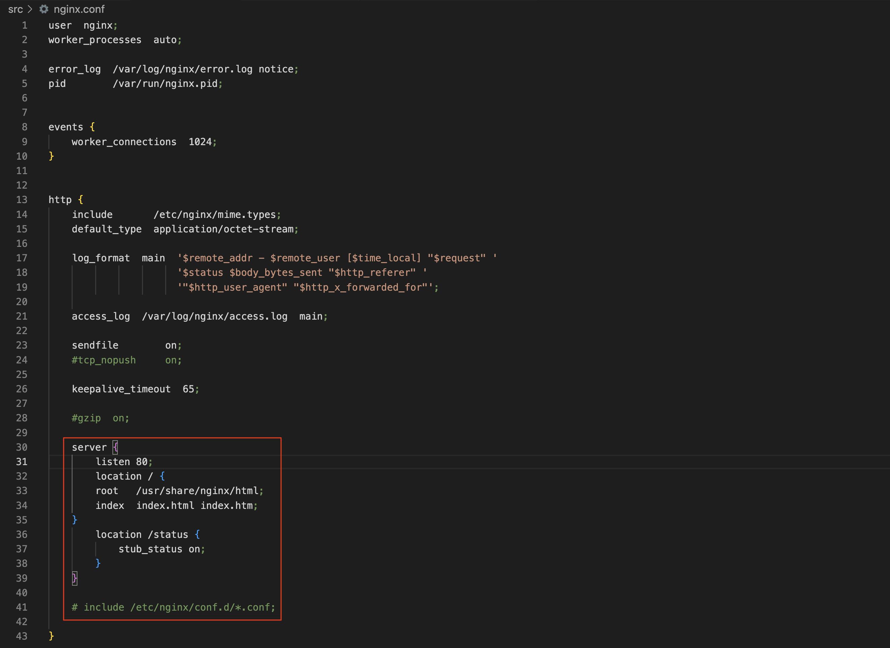   
Но:  
    - Добавим кусок кода, который будет выдавать по дефолту стартовую страницу nginx и при обращении по /status статус сервера(stub_status)  
    - Закомментим “include /etc/nginx/conf.d/*.conf” – если этого не сделать, то nginx по дефолту будет считать приоритетным файлы из conf.d, то есть в нашем случае default.conf, а там есть указание только на стартовую страницу nginx.   
    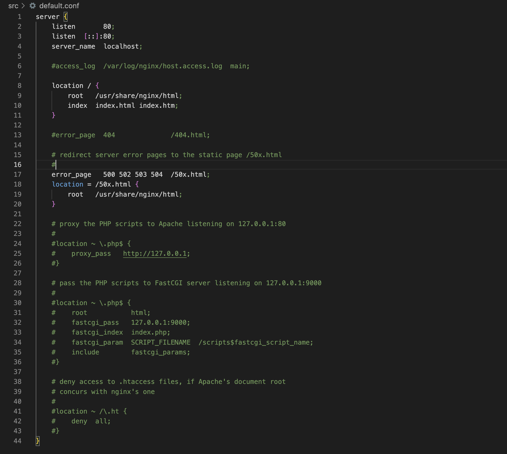   
    Соответственно, чтобы иметь доступ и к стартовой странице, и к /status, то нам нужно либо добавить указание на то, что делать при /status в default.conf, либо указание на то, что делать при дефолтном localhost в ngix.conf. Я так понял. По зданию нужно сделать второе.  
- Скопируем созданный файл nginx.conf внутрь докер-образа через команду docker cp.  
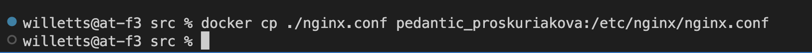   
- Перезапустим nginx внутри докер-образа через команду exec. Для этого используем команду “nginx -s reload”, но лучше сначала использовать команду “nginx -t” (это что-то типа netplan try)  
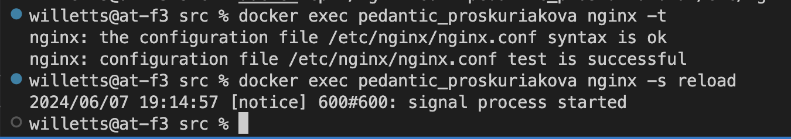   
- Проверим, что по адресу localhost:80/status отдается страничка со статусом сервера nginx  
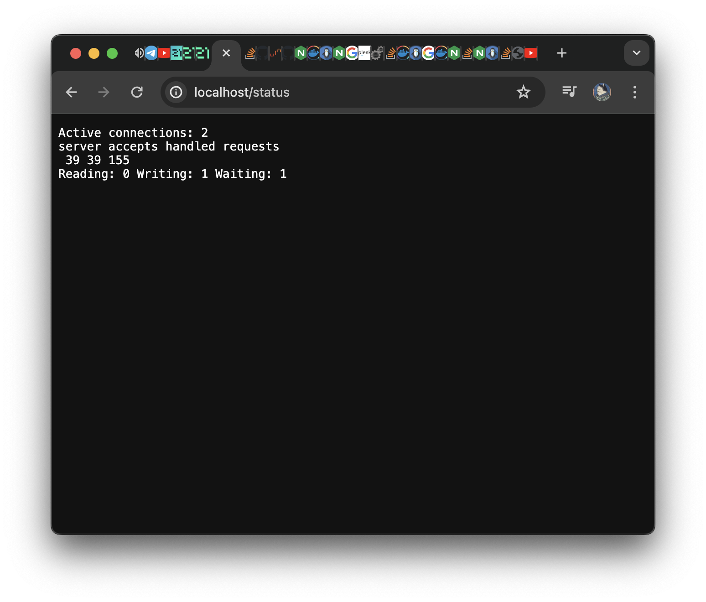   
- Экспортируем контейнер в файл container.tar через команду export.  
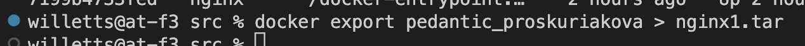   
- Остановим контейнер.  
   
- Удалим образ через docker rmi [image_id|repository], не удаляя перед этим контейнеры  
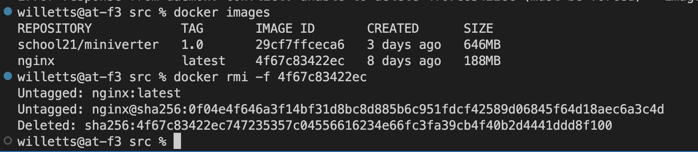   
- Удалим остановленный контейнер  
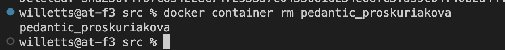   
- Импортируем контейнер обратно через команду import  
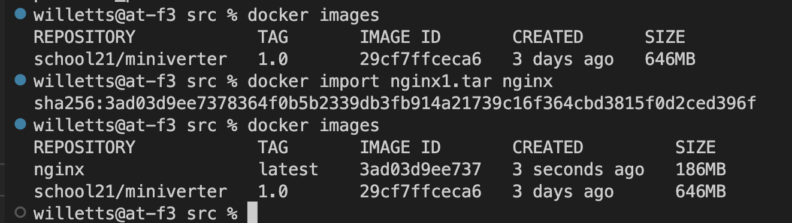   
- Запустим импортированный контейнер. Но он не запускается так просто  
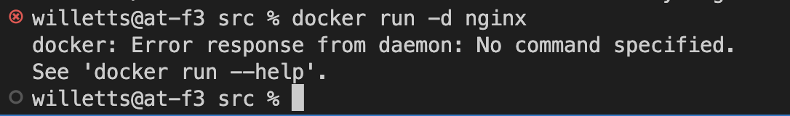   
Причина в том, что команды import/export нужны для копирования файловой системы контейнера, а для переноса image чаще используют save/load. Соответственно, многие из настроек оригинального nginx, который мы пулили c docker_hub, не перенеслись в наш новый nginx, так как мы использовали команду export. Однако это можно исправить вручную. Для этого нужно:  
    - Запулить оригинальный nginx  
    - С помощью inspect посмотреть его настройки  
    - С помощью того же inspect посмотреть настройки нашего текущего “nginx”   
    - Сравнить; посмотреть чего не хватает нашему.  
       
     Из того, что мы можем исправить при импорте – это Cmd и Entrypoint (Env тоже, вроде, можно, но не обязательно)  
    - Импортировать с исправлениями и запустить контейнер  
    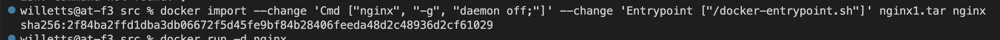   
    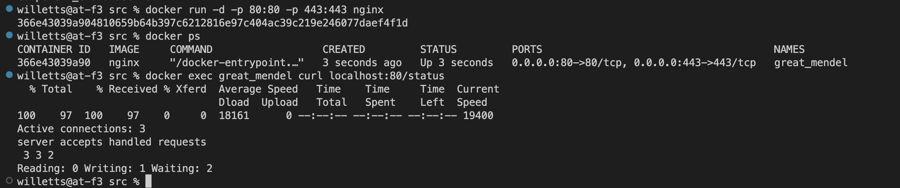   

## Part 3. Мини веб-сервер

- Напишем мини-сервер на C и FastCgi, который будет возвращать простейшую страничку с надписью Hello World!  
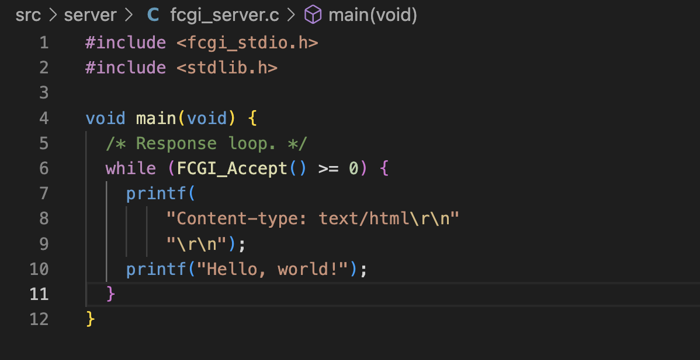   
    - Если это всё делается со школьного мака, то во-первых, земля пухом 🙏, а во-вторых, нужно установить через brew пакеты “fcgi” и “spawn-fcgi” и потому что это школьный мак, то нужно его мордой потыкать в то, куда fcgi установился, то есть прописать в корневом файле .zshrc путь до библиотеки fcgi; в противном случае он будет выдавать ошибку, мол, ему библиотека fcgi_stdio.h незнакома  
    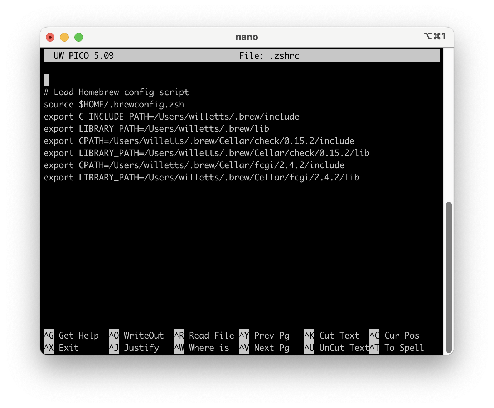   
    - После всех этих манипуляций можно по примеру [отсюда](https://fastcgi-archives.github.io/fcgi2/doc/fastcgi-prog-guide/ch2c.htm) написать файл мини-сервера  
    - Затем нужно скомпилировать всё это с флагом -lfcgi в .fcgi файл   
   
- Запустим мини-сервер через spawn-fcgi на порту 8080  
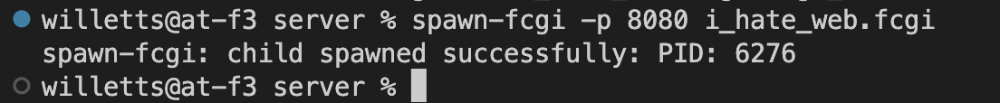   
- Напишем свой nginx.conf, который будет проксировать все запросы с 81 порта на 127.0.0.1:8080   
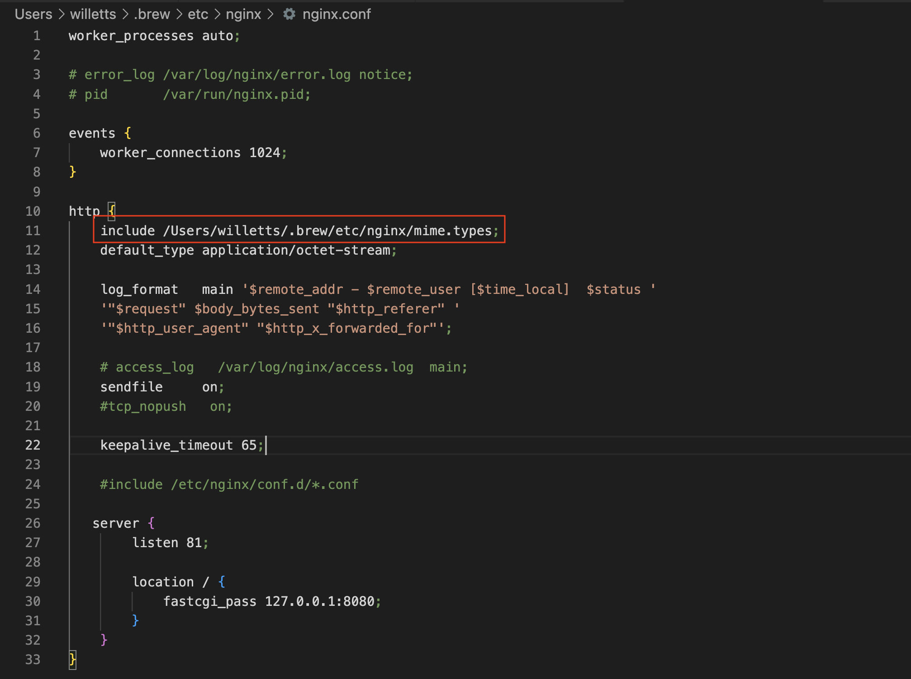   
Здесь главное понять, куда потом после создания этот конфиг пихать (и какой include там писать), потому что не всегда понятно, куда установился nginx.  
Для нахождения директории nginx можно посмотреть на вывод команды nginx -t, которая проверяет на правильность конфигурационный файл nginx.   
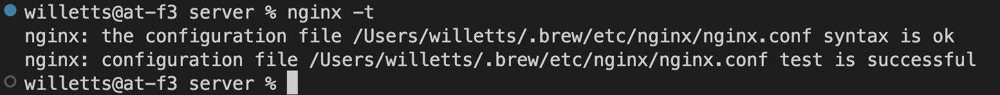   
То есть, в моём случае – это “/Users/willetts/.brew/etc/nginx/nginx.conf”, соответственно конфигурацию нужно с заменой переместить по этому адресу, а в include написать “/Users/willetts/.brew/etc/nginx/mime.types”.  
Ну и нужно не забыть, собственно, запустить nginx командой nginx
- Проверим, что в браузере по localhost:81 отдается написанная нами страничка.   
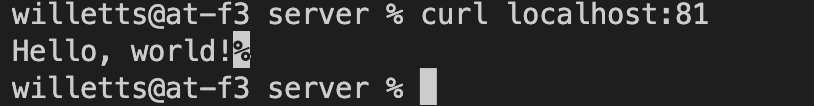   
- Положим файл nginx.conf по пути ./nginx/nginx.conf (с этим я без проблем справился хах)

## Part 4. Свой докер

 - Напишем свой докер-образ, который:
    1) собирает исходники мини сервера на FastCgi из Части 3;
    2) запускает его на 8080 порту;
    3) копирует внутрь образа написанный ./nginx/nginx.conf;
    4) запускает nginx.  
    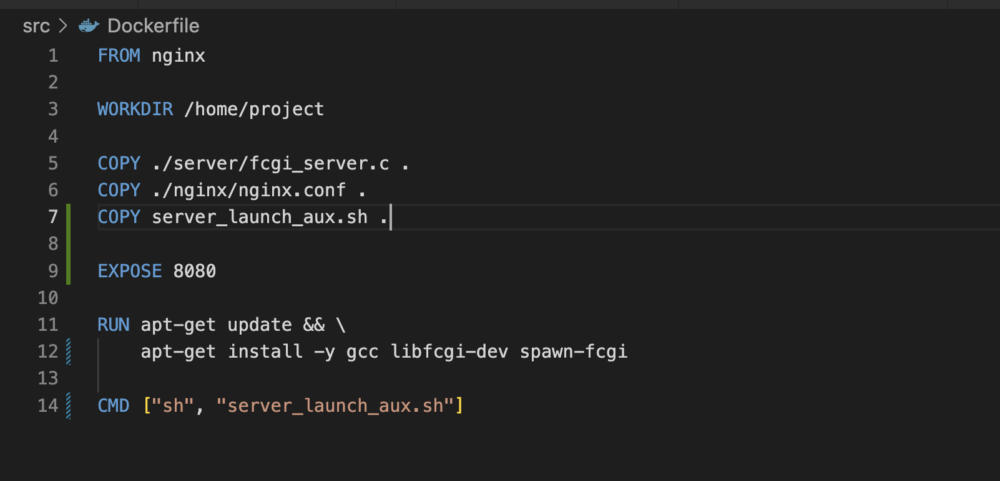   

    Тут это осуществляется через докерфайл, который  
    1. собирает образ на основе nginx, 
    2. копирует туда наш код для поднятия сервера, конфигурацию nginx, и файл баш, в котором прописаны команды для непосредственного запуска сервера, 
    3. устанавливает в него разные зависимости, которые нам нужны,
    4. запускает - предварительно скопированный в контейнер - файл баш, который непосредственно поднимает сервер    
     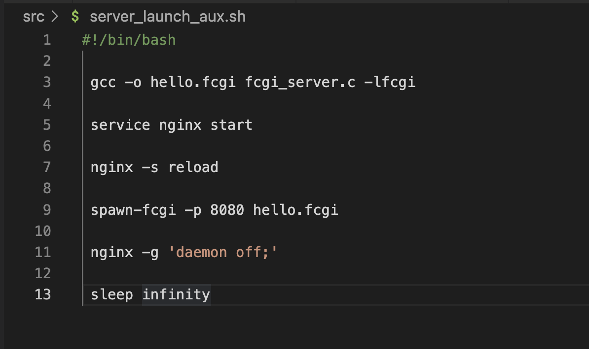   
- Соберём написанный докер-образ через docker build при этом указав имя и тег.  
 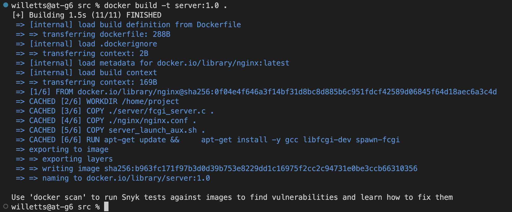   
- Проверим через docker images, что все собралось корректно.     
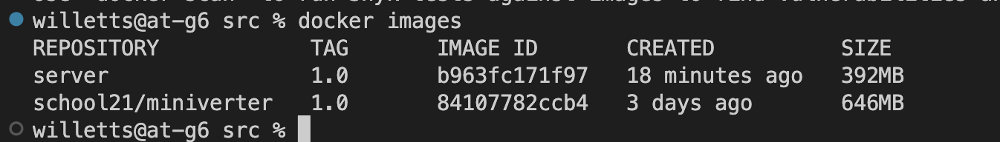   
- Запустим собранный докер-образ с маппингом 81 порта на 80 на локальной машине и маппингом папки ./nginx внутрь контейнера по адресу, где лежат конфигурационные файлы nginx'а  
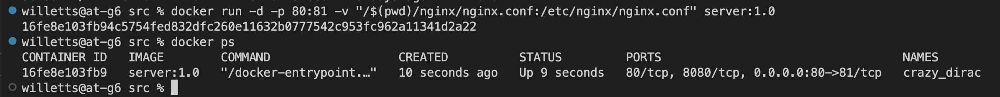   
- Проверим, что по localhost:80 доступна страничка написанного мини сервера.  
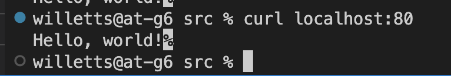   
- Допишем в ./nginx/nginx.conf проксирование странички /status, по которой надо отдавать статус сервера nginx.  
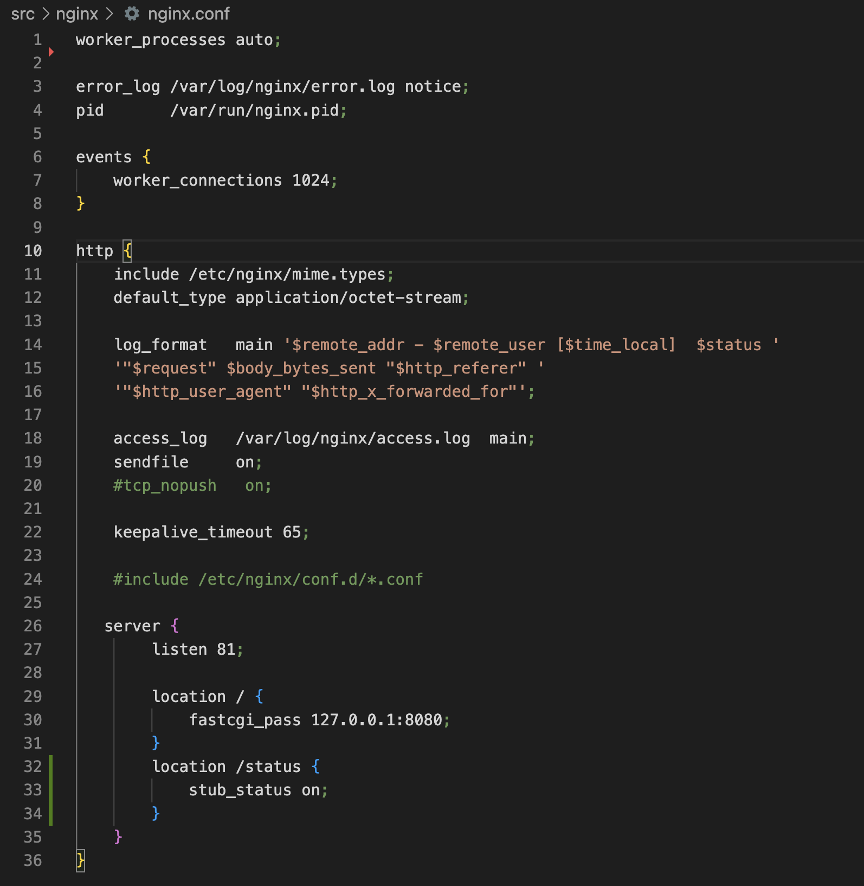   
- Перезапустим докер-образ и проверим страничку /status  
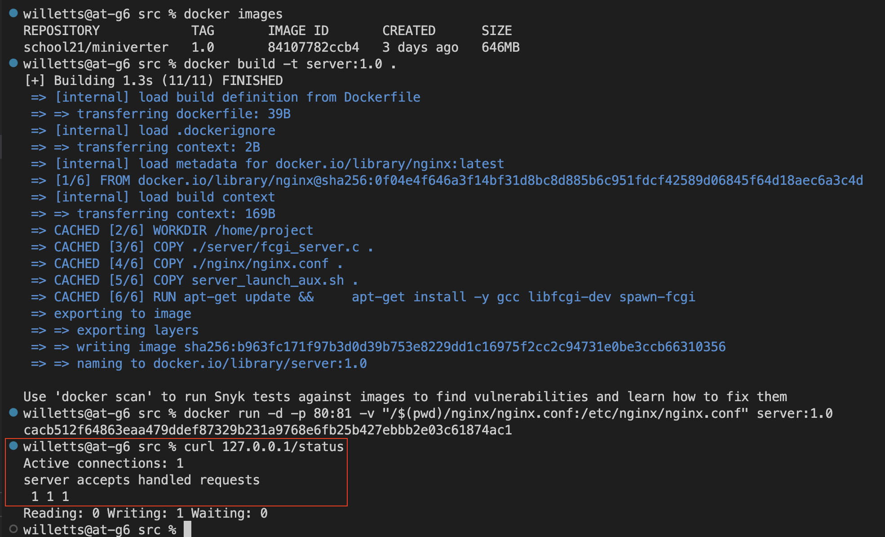   

## Part 5. Dockle

Просканируем образ из предыдущего задания через dockle [image_id|repository].  
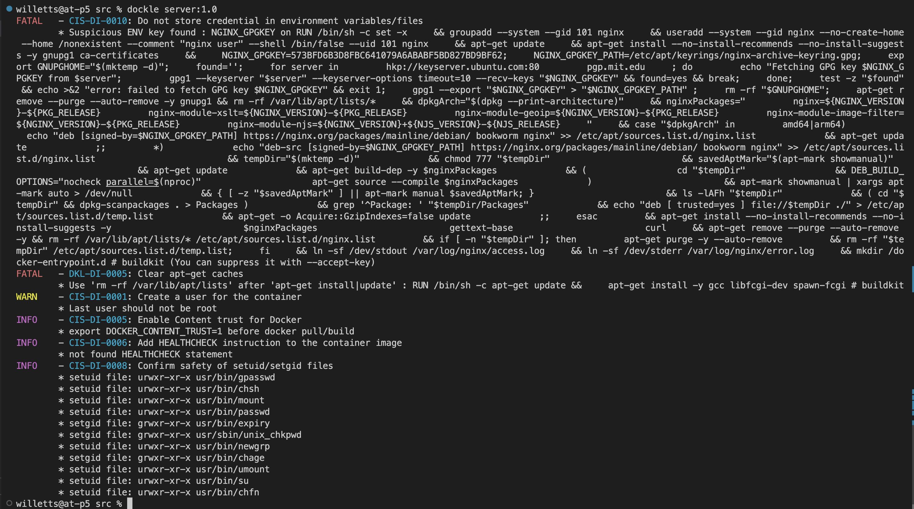   
Исправим всё так, чтобы при проверке через dockle не было ошибок и предупреждений.
- Первая ошибка (CIS-DI-0010) возникает из-за каких-то проблем с environment переменными. Так как, перечисленных в выводе ошибки, переменных  нет ни в среде, в которой я выполняю проект, ни в контейнерах, созданных по данному образу – вероятно, что они каким-то образом хранятся в самом nginx, поэтому специально для dockle я немного переписал Dockerfile, чтобы он создавался не на основе nginx, а на основе ubuntu, а nginx бы туда просто подгружался как пакет.  
Также я его сделал немного красивее и избавился от второй фатальной ошибки  
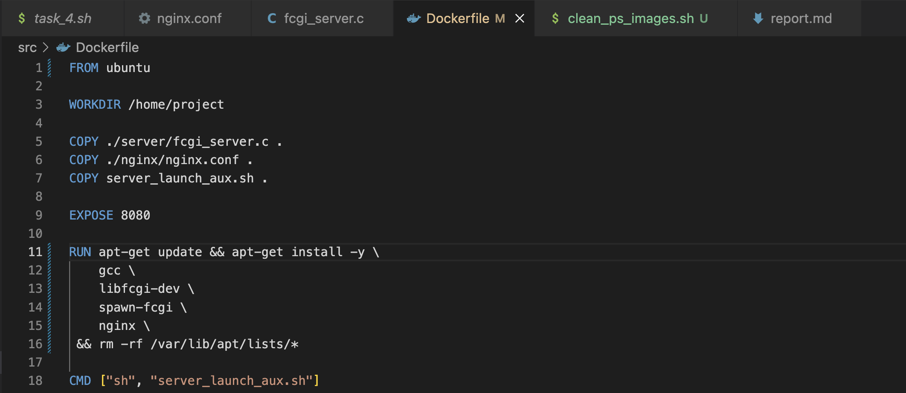   
- Третья ошибка (CIS-DI-0001) жалуется на то, что в Dockerfile существует только root пользователь, однако при попытках создать нового пользователя и наделить его правами админа (то есть переделать Dockerfile примерно так)  
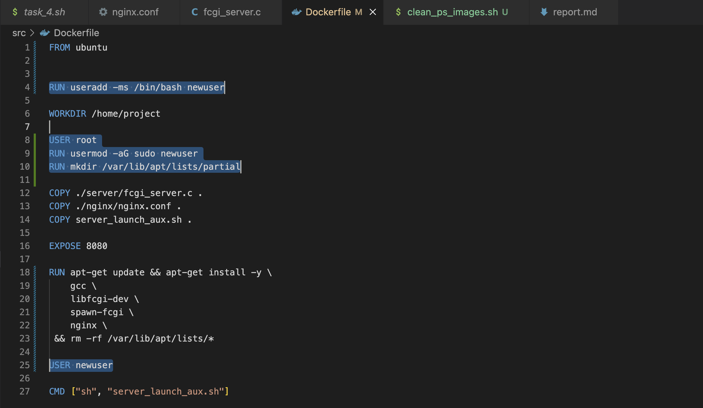   
Сервер перестаёт нормально работать (хотя образ и контейнеры нормально создаются и запускаются)  
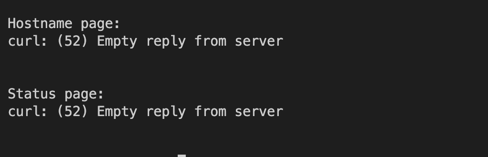   
Поэтому было принято решение просто прописывать dockle со спецификатором -i CIS-DI-0001  
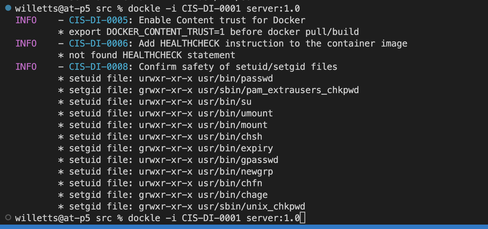   

## Part 6. Базовый Docker Compose

Напишем файл docker-compose.yml, с помощью которого:
1) Поднимим докер-контейнер из Части 5 (он должен работать в локальной сети, т.е. не нужно использовать инструкцию EXPOSE и мапить порты на локальную машину).
2) Поднимим докер-контейнер с nginx, который будет проксировать все запросы с 8080 порта на 81 порт первого контейнера.
Замапим 8080 порт второго контейнера на 80 порт локальной машины.
По сути здесь мы просто прописываем ещё один Докерфайл для сервера-прокси и с нашего оригинального сервера через этот сервер-прокси выводим "Hello, World!" Для этого нам понадобится:
- Dockerfile прокси с дополнительным bash файлом  
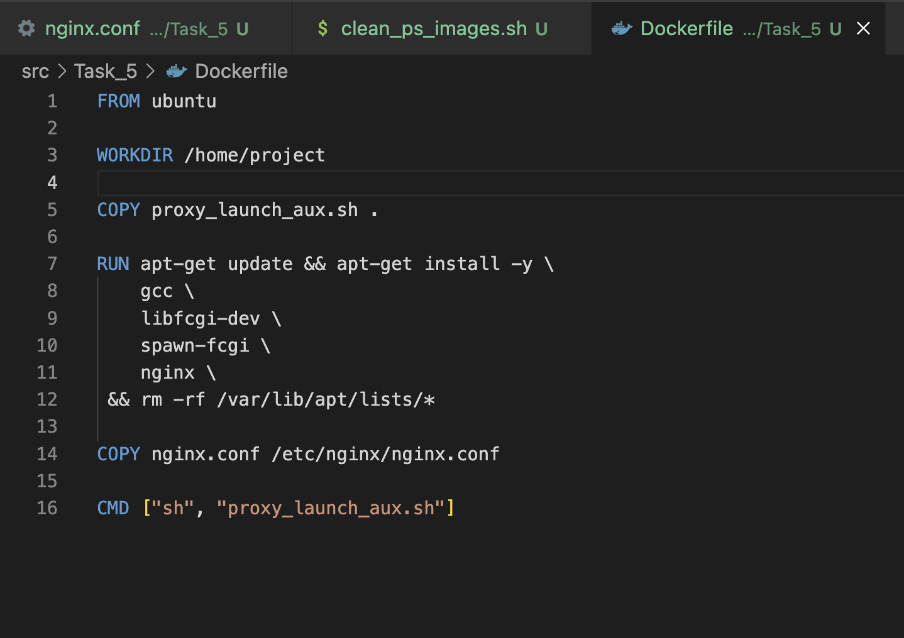   
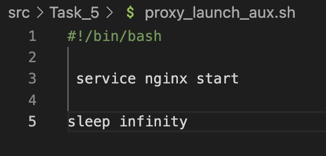   
- Nginx конфигурация для сервера-прокси  
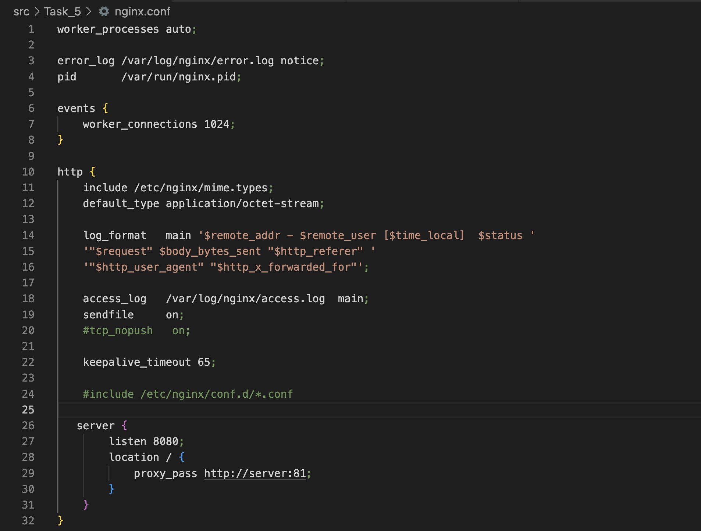   
- Наконец, docker-compose.yaml, который будет собирать это всё вместе с сервером из прошлого задания  
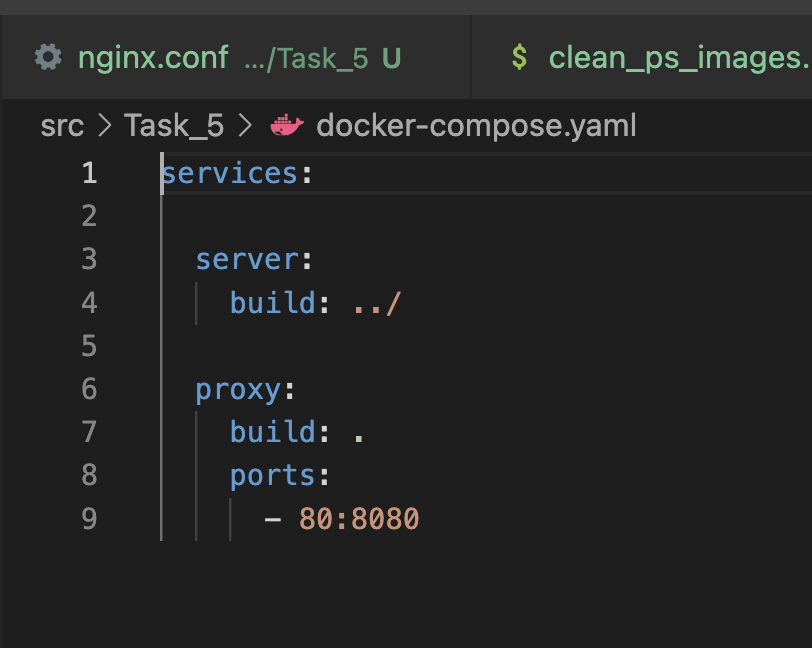   

Спасибо за внимание, удачи и успехов (если ты не Dockle)